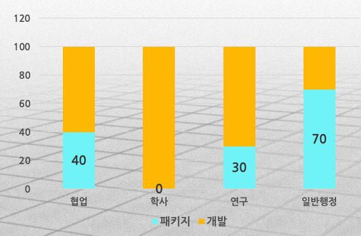
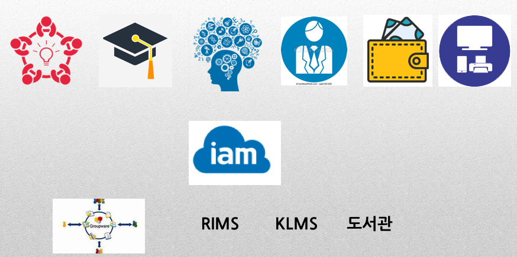
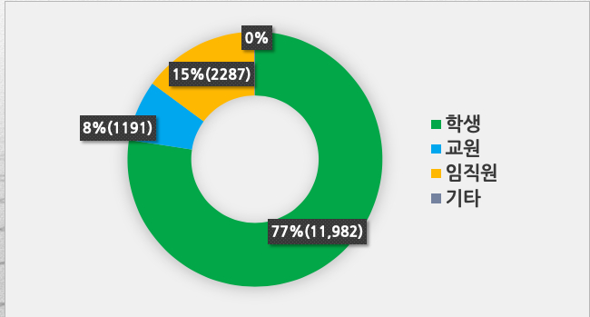
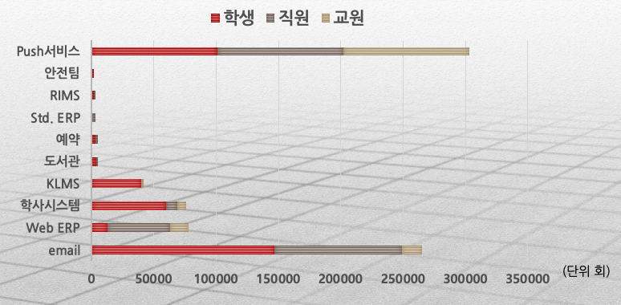
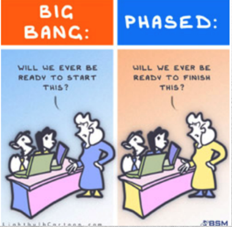
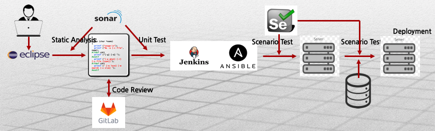

##CRP(Campus Resource Planning) 3.0@KAIST

본 문서는 한국과학기술원 대학정보화사업에서 수행하는 대학정보화시스템(CRP3.0@KAIST)을 구축하기 위한 시스템 설계 개념, 구조와 소요 기술 요소를 기술하여 사업 진행에 기초로 활용할 수 있도록 하는데에 그 목적이 있다.

created by <a href="mailto:yoonjoon.lee@kaist.edu">이윤준</a> on Jan. 24, 2019

revised by ...

### Executive Summary

2017년 9월부터 세번째 통합대학정보시스템(CRP 3.0) 구축을 위한 대학정보화사업본부를 구성하고 사업을 시작하였다. CRP 3.0은 크게 학사서비스, 연구관리서비스, 일반행정서비스와 협업서비스의 네 사용자 서비스와 시스템 개발 및 운영 환경 구축으로 구성되어 있다. 시스템은 현재 인터넷 서비스에서 보편적으로 사용되는 클라우드 컴퓨팅 기술과 Micro Service Architecture 개념을 적용하여 설계하였고, 시스템 품질 향상과 원활한 서비스를 위하여 단계별 서비스 개시와 개발에서 운영에 이르는 일관 공정 전략을 택하여 구축하고 있다. 공개 소프트웨어를 적극 활용하며 산출물 또한 공개할 예정이다. 이렇게 함으로써 KAIST 정보시스템을 효율적으로 구축하며, 대학 정보화에서 리더쉽을 확보하며, 국내 대학과 사업 참여 기업이 윈윈하는 기회로 삼고자 한다.

### 1 배경 및 개요

KAIST 대전 이전에 따라 정보시스템 CAIS(Campus Advanced Information System)를 Client-Server 기술울 채택하여 자체 개발을 시작하여 학사, 연구 일반행정에 부분적으로 적용하여 사용하기 시작하였다. 지속하여 기능을 확산하고 개선하여 운영하였다.

21세기를 맞이하여 전체적인 종합정보화시스템 구축의 요구에 따라 Oracle ERP인 Apps를 도입하여 구축 사업을 수행하였다. 그러나 ERP의 학사 기능의 부재로 인하여 학사서비스는 기존의 CAIS 학사서비스를 개선하여 운영하였다. 대부분의 학교 행정 업무가 전산화되었으며 특히 재무, 인사 등 일반행정서비스와 연구관리서비스 등에서 정보화가 이루어쟜다고 할 수 있다. 그러나 ERP라는 솔루션을 채택하여 운영함에 따라 기능 개선 및 유지 보수를 위한 전문 인력 확보에 어려움을 겪고 있었다. 또한 구축시 과도한 맞춤(customizing) 개발에 기안하는 ERP 업그레이드 비용 증가를 극복하여야 했다.

2014년 ERP를 사용하여 구축하지 않았던 학사서비스 개선을 위하여 학사서비스 ISP 사업을 시행하여 새로운 종합정보시스템 구축 사업의 시작하였다. 이어 2016년 통합정보시스템 ISP을 수행하여 향후 사용할 정보시스템의 방향과 구축 전략을 도출하였다. 이를 바탕으로 2017년 9월 대학정보화사업본부를 임시로 설치하여 통합정보시스템(이하 CRP 3.0이라 함) 구축 사업을 3년 계획으로 수립하여 수행하고 있다.

새로이 구축되는 통합정보시스템은 크게 학사서비스, 연구관리서비스, 일반행정서비스와 협업서비스의 4개 서비스 시스템과 시스템 개발 및 운영 환경 구축으로 구성되어 있다. 학사서비스는 다시 학적, 수업, 성적, 생활관, 의료상조, 등록, 장학, 졸업, 학생지원, 학생생활, 국제협력, 리더싑 등의 서비스로 구성되어 있다.

연구관리서비스는 연구과제, 참여연구원, 예산/지출, 인건비, 정신, 외부연계, 기술사업화 등의 서비스로 구성되며, 일반행정서비스는 인사, 급여, 예산및자금, 회계, 구매, 자산관리 등의 서비스를 제공한다. 협업서비스는 포털, 이메일, 캘린더, 연락처, 게시판 등의 서비스로 이루어져 있다.

통합정보시스템을 운영 환경을 구축하기 위하여 통합인증 및 권한 관리를 위하여 IAM 서비스와 데이터베이스 제공 서비스가 제공되어야 하며, 개발환경은 이슈관리, 버전관리, SW테스트, 배포 등의 서비스를 구축한다.

### 2. 개념

정보시스템의 사용자는 2018년 6월 현재 약 15,500명으로 사용자 수로는 결코 작은 시스템이라 할 수 없다.

2017년 10월과 11월 2개월 동안의 서비스 사용 현황을 보면 아래 그림과 같다.

새로이 구축되는 통합정보시스템 CRP 3.0은 사용자 관점에서 1) 사용 편이성을 개선하여야 하며, 2) 일정 수준의 시스템의 소프트웨어 품질을 보장하여야 하며, 3) 정책 변화를 신속하게 수용할 수 있어야 한다. 또한 시스템 관점에서는 컴퓨팅 자원을 효율적으로 운영할 수 있는 환경을 제공하고, 사용자 인증과 권환 관리를 통한 시스템 보안을 향상토록 한다. 이를 달성함으로써 대학정보화를 견인할 수 있을 것이다.

사용 편이성을 향상하기 위하여 기본 설정을 활용하고, 사용자 인터페이스를 개선하여 보다 직관적으로 사용할 수 있도록 하며, 모바일 환경 등을 지원할 수 있도록 한다. 소프트웨어 품질 향상을 위하여 이슈관리, 버전관리, SW테스트, 배포 등을 수행하는 일관 공정의 소프트웨어 개발 프로세스를 구축하여 DevOps 환경을 지원할 수 있도록 한다. 변화를 신속하게 반영할 수 있도록 서비스를 세분화하고 서비스를 독립적으로 변경 배포 운영할 수 있도록 Micro Service Architecture를 준용하여 설계하고 이에 따라 개발한다.

Cloud computing 환경을 구축하여 운영함으로써 컴퓨팅 자원을 효율적으로 운영할 수 있는 환경을 제공한다. MSA(Micro Service Architecture)와 함께 적용함으로써 컴퓨팅 자원을 탄략적으로 활용할 수 있도록 한다. 가능한 공개 소프트웨어(OSS:Open Source Software)를 활용하여 시스템을 구축함으로써 업그레이드와 유지 보수를 지속성을 보장하고자 한다. 나아가서는 산출물인 개발된 소프트웨어를 공개함으로써 대학정보화의 리더쉽을 확보하고자 한다.

### 3. 서비스시스템 구조

서비스 시스템은 앞에서 언급한 학사, 연구관리, 일반행정, 협업 서비스로 구성되어 있으며 이를 운영하기 위한 시스템 서비스인 IAM과 데이터베이스 서비스로 구성되어 있다. 특히 사용자 서비스는 다시 각각 10개 내외의 세분화된 MSA로 이루어져 있다. 이들 MSA는 필요에 따라 각각 수정, 테스트, 배포 운영 가능하도록 상호 독립적으로 운영될 수 있도록 구성되어 있다. 그 결과 사용 부하에 따라 탄력적으로 서비스를 확대할 수 있다. 예를 들면 학적, 수업, 성적, 생활관, 의료상조, 등록, 장학, 졸업, 학생지원, 학생생활, 국제협력, 리더싑 등 MSA로 학사서비스를 구성하여 독립적으로 운영한다면 수업서비스의 부하가 높아지는 수강 신청기간에는 수업서비스를 확장함으로써 서비스를 원활히 수행할 수 있다.

서비스의 탄력적인 운영을 위하여 클라우드 컴퓨팅 환경은 필수적이다. 클라우드 컴퓨팅 기술을 정보시스템 운영 환경에 적용함으로써 MSA의 운영을 보다 효율적으로 할 수 있다. 위에서 열거한 사용자 서비스를 구성하는 MSA는 PaaS(Platform as a Service)를 제공하는 Docker를 채택하여 컨테이너로 서비스를 구축하며 이들을 관리 운영할 수 있는 환경을 구축한다.

시스템 서비스인 IAM과 데이터베이스 서비스는 일정 이상의 부하를 갖는 서비스로서 IaaS(Infra as a Service) 또는 Bare Metal 서비스로 구축한다. 이 모두를 한 관리도구에서 제어 관리함으로써 효율적인 시스템을 구축할 수 있을 것으로 기대한다.

### 4. 구축전략

통합정보시스템 구축의 핵심 구축 전략은 1) 단계별 서비스 개시 (Phased Deployment) 2) 개발에서 운영에 이르는 일관 공정(DevOps)와 3) 공개 소프트웨어(OSS)의 적극 적용과 산출물 공개이다. 단계별 서비스 전략은 운영과 구축에 기술적으로 선결해야 할 문제를 갖고 있으나 개발 단계에서 사용자로부터 feedback을 받아 개선할 수 있는 기회를 제공할 수 있다는 점에 긍정적이며 구성원에게 일의 진척 상황을 알릴 수 있어 참여도를 증진시킬 수 있는 장점이 있다.

소프트웨어 개발 프로세스를 작성, 테스트, 구축, 배포에 이르는 개발 과정을 일관 공정으로 처리할 수 있도록 개발 환경을 구축하여 서비스 개발 전과정에 적용한다. 이를 위하여 이슈관리를 위한 Redmine, 프로그램 개발 환경 IDE(integreated develop environment), 프로그램 소스의 버전관리를 위한 GitLab, 소프트웨어 테스트를 위한 SonarQube, 서비스 생성과 배포를 위한 Jenkins, Ansible 등 활용하여 일관 공정을 구축하여 개발에 적용한다. 테스트 케이스 데이터 베이스를 운영함으로써 개발되는 소프트웨어 품질 향상을 기대할 수 있다. 또한 운영시 프로그렘 수정 후 이 공정을 적용함으로써 보다 높은 품질의 소프트웨어 유지 보수을 보장할 수 있다.

마지막 전략으로 공개 소프트웨어의 적극적인 활용이다. 최근 인터넷 서비스를 구축하는 데에 있어서 공개 소프트웨어 활용은 매우 보편화 되었다. 특히 클라우드 컴퓨팅이 이를 이끌고 있다. 이는 비용적인 면뿐만아니라 업그레이드와 유지 보수면에서도 긍정적인 실례를 보여주고 있다. 이에 대학 정보시스 구축에 있어서도 앞에서 언급한 개발환경구축 뿐만아니라 시스템 구성 요소로서도 적극 활용할 계획이다. 시스템 구성 요소의 대표적인 예로 Docker를 들 수 있다. 나아가서는 사업의 산출물을 시스템 보안에 민감한 부분을 제외한 대부분의 프로그램 코드를 공개할 예정이다. 그럼으로써 대학정보화사업에 어려움을 겪고 있는 국내 대학에 도움을 줄 수 있을 것으로 기대하며 나아가서는 KAIST 리더쉽을 증진할 수 있을 것이다. 또한 개발에 참여한 기업들에게도 구축, 운영 및 유지 보수에서 사업 기회를 늘릴 수 있을 것으로 기대한다.

### 5. 맺는말

학사서비스, 연구관리서비스, 일반행정서비스와 협업서비스의 사용자 서비스와 시스템 개발 및 운영 환경으로 통합정보시스템 CRP 3.0은 이루어져 있다. 위에서 언급한 바와 같이 클라우드 컴퓨팅과 Micro Service Architecture를 준용하여 시스템을 구축하고자 한다. 또한 단계별 서비스 구축 전략으로 개발을 진행하고 개발에서 운영에 이르는 공정을 일관화하여 소프트웨어 품질을 높이고자 한다. 이를 위하여 공개 소프트웨어를 적극 활용함은 물론 산출물 또한 공개하고자 한다.

그러나 이같은 목표를 달성하려면 지금까지 개발, 운영 및 유지 보수를 외주에 의존하여 관리 위주의 IT부서의 역량을 한 단계 업그레이드하여야 한다. 구축과 동시에 IT 부서원의 역량 강화 또한 수반되어야 한다. 이를 위하여 적절한 교육과 IT 부서원들의 노력이 같이 수반되어야 할 것이다. KAIST에서 이같은 변화가 쉬운 일은 아니다. 그러나 이같은 변화없이는 혁신을 추구하는 학교의 빠른 변화를 좇아갈 수 없을 것이다.
